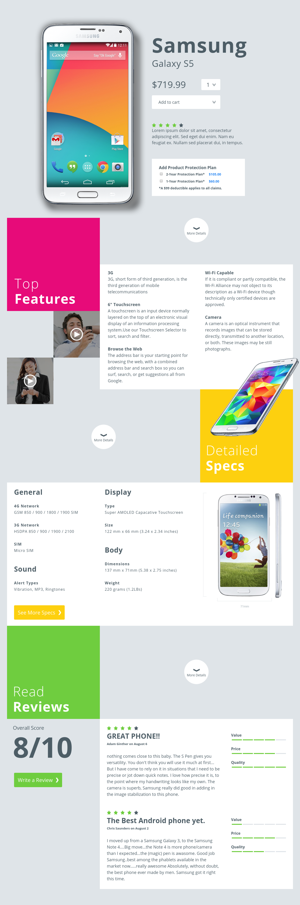

# CSS Assessment

This is a technical assessment of my abilities as a frontend developer.
It was completed, along with the [BBYC Assessment] for a position at the BestBuy headquarters in Burnaby.
This project does not include any javascript frameworks, as it was intended to focus on CSS layouts only.
It does however rely on [Node] and [Gulp] to compile assets.
I was given designs and tasked with converting them to a frontend layout.
Responsive design was not a technical requirement, so the layout is fixed at `1220px`.



#### How To Install

* `npm install` : Install required modules
* `npm start` : Start http server
* `npm run build` : Bundle assets for browser
* `npm run watch` : Watch for file changes and rebuild

#### How To Use

1. Open http file directly in browser
```
open public/index.html
```

2. Start dev server and open localhost url
```
npm start -- -o
```

[Node]: https://nodejs.org/
[Gulp]: https://gulpjs.com/
[BBYC Assessment]: https://github.com/jabes/bbyc-assessment
